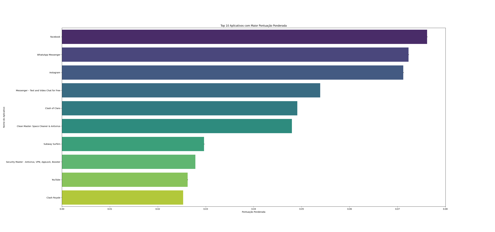
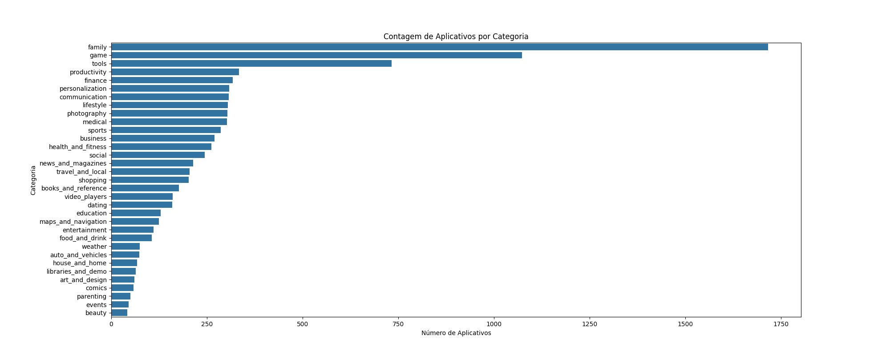
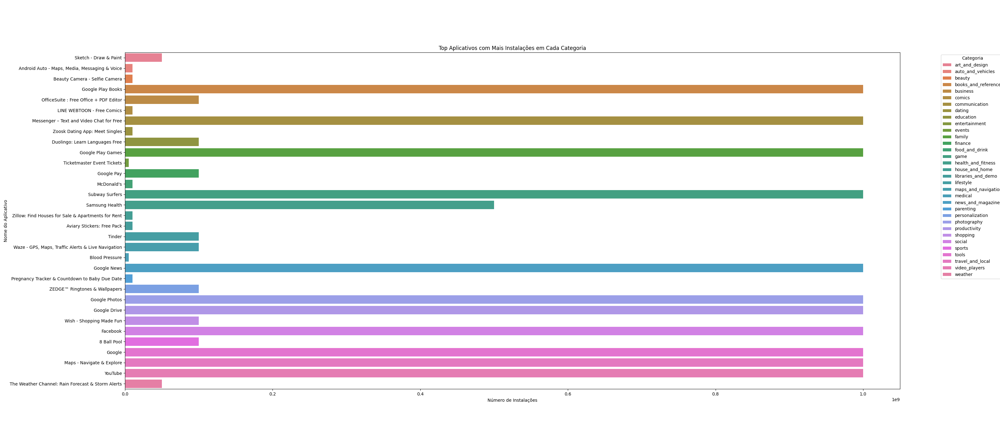

# ETL Project: Análise de Aplicativos da Google Play Store

Este projeto consiste em um pipeline de ETL (Extract, Transform, Load) que processa dados de aplicativos da Google Play Store. O objetivo é extrair os dados de um arquivo CSV, transformá-los para limpar e calcular métricas relevantes, e carregar os dados transformados em um banco de dados SQLite. Além disso, o projeto gera gráficos de análise com base nos dados processados.

## Funcionalidades

- **Extração de Dados**: Leitura de um arquivo CSV com dados da Google Play Store.
- **Transformação de Dados**: Limpeza de dados, cálculo de métricas como pontuação ponderada baseada em avaliações (reviews) e notas (ratings).
- **Carregamento de Dados**: Armazenamento dos dados transformados em um banco de dados SQLite.
- **Visualização**: Geração de gráficos que mostram as análises dos dados.

## Estrutura do Projeto

- **`main.py`**: Script principal que executa o processo ETL e gera os gráficos.
- **`datasets/`**: Diretório onde o arquivo CSV original é armazenado.
- **`etl_database.db`**: Banco de dados SQLite gerado durante o processo ETL.
- **`top_10_weighted_score.png`**: Gráfico dos 10 principais aplicativos com a maior pontuação ponderada (rating x reviews).
- **`top_10_wd_score.png`**: Gráfico dos 10 principais aplicativos com a maior pontuação ponderada (rating x reviews).
- **`yop-apps-category.png`**: Gráfico dos aplicativos com o maior número de avaliações (reviews).

## Requisitos

- Python 3.6 ou superior
- Pandas
- Matplotlib
- Seaborn
- SQLite3
- Docker (opcional, para executar o projeto em um contêiner)

## Instalação

1. Clone este repositório:

   ```bash
   git clone https://github.com/gabrieldomingos33/etl-apps.git
   cd etl-apps

2. Crie e ative um ambiente virtual (recomendado):

   ```bash
    python3 -m venv myenv
    source myenv/bin/activate  # No Windows use `myenv\Scripts\activate`

3. Instale as dependências:

    ```bash
    pip install -r requirements.txt

### Resultados
Top 10 Aplicativos com Maior Pontuação Ponderada

Este gráfico mostra os 10 aplicativos com a maior pontuação ponderada, calculada com base na média das notas e na quantidade de avaliações.


Top 10 Aplicativos com Mais Avaliações

Este gráfico mostra os aplicativos mais baixados de cada categoria.

Top aplicativos por categoria


Este gráfico mostra os top apps de cada categoria

### Contribuição
Contribuições são bem-vindas! Sinta-se à vontade para abrir issues e pull requests.

